# Uber Real-Time Ingestion & Analytics Pipeline

An end-to-end real-time data engineering project demonstrating dynamic metadata-driven ingestion, stream-static joins, Slowly Changing Dimensions (SCD) Type 2 tracking, and watermarked aggregations using **Azure Data Factory**, **ADLS Gen2**, **Azure Event Hubs**, and **Azure Databricks (Delta Live Tables & Unity Catalog)**.

---

## 1. System Architecture

The pipeline uses a hybrid medallion architecture combining batch lookup data with real-time ride transactions:

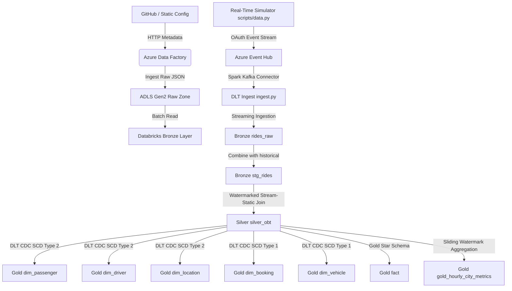

### Existing Azure Infrastructure Setup
Here is the active resource group overview supporting this pipeline in Azure:

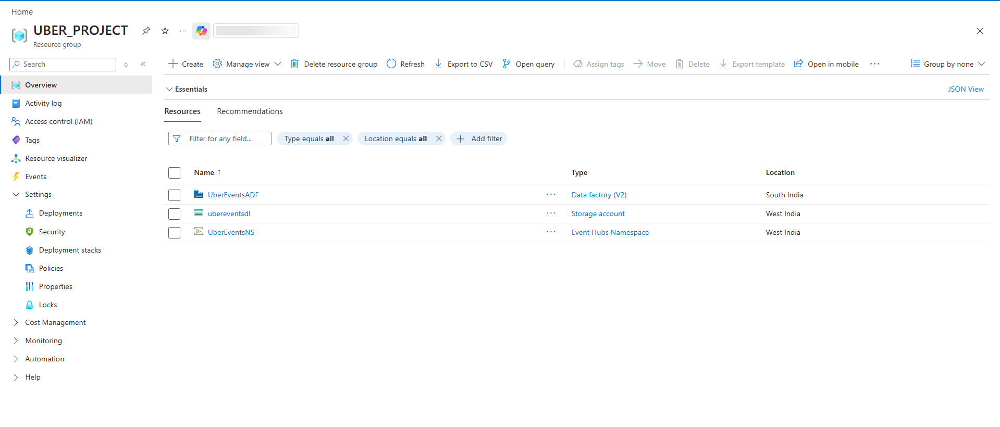

---

## 2. Ingestion & Orchestration Layer

### Batch Lookup Ingestion (ADF)
* **Metadata-driven Copy:** A Lookup activity reads [config.json](file:///g:/LIVE/uber-data-pipeline/config.json) containing static metadata categories and drives a ForEach loop, running parameterized HTTP-to-Blob Copy activities to dump lookup tables into ADLS Gen2.
* **Storage Structure:** Maps configurations (`map_cities.json`, `map_payment_methods.json`, etc.) to the ADLS Bronze layer container.

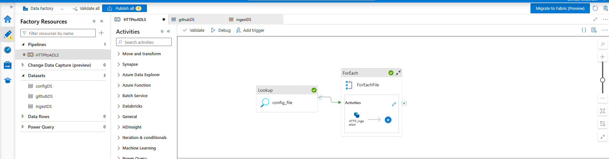
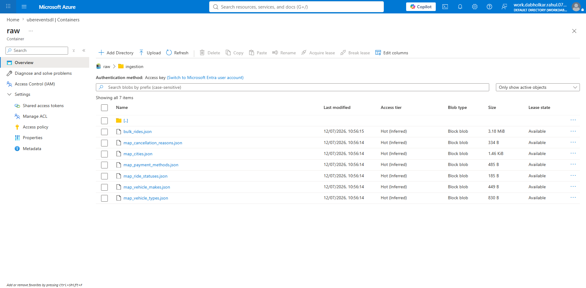

### Real-Time Stream Ingestion (Event Hub)
* **Event Simulator:** The Python script [scripts/data.py](file:///g:/LIVE/uber-data-pipeline/scripts/data.py) draws from static pools of drivers and passengers, generating ride confirmations with a 10-15% chance of updating details (ratings, email, phone) to simulate real-world updates.
* **Message broker:** Pushed dynamically via [scripts/connection.py](file:///g:/LIVE/uber-data-pipeline/scripts/connection.py) to Azure Event Hub.

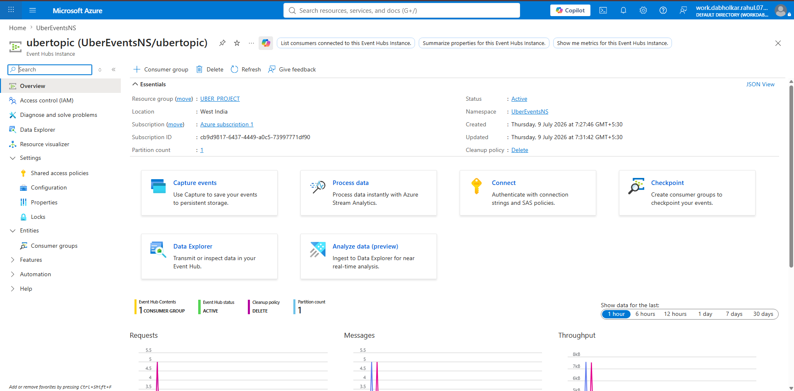
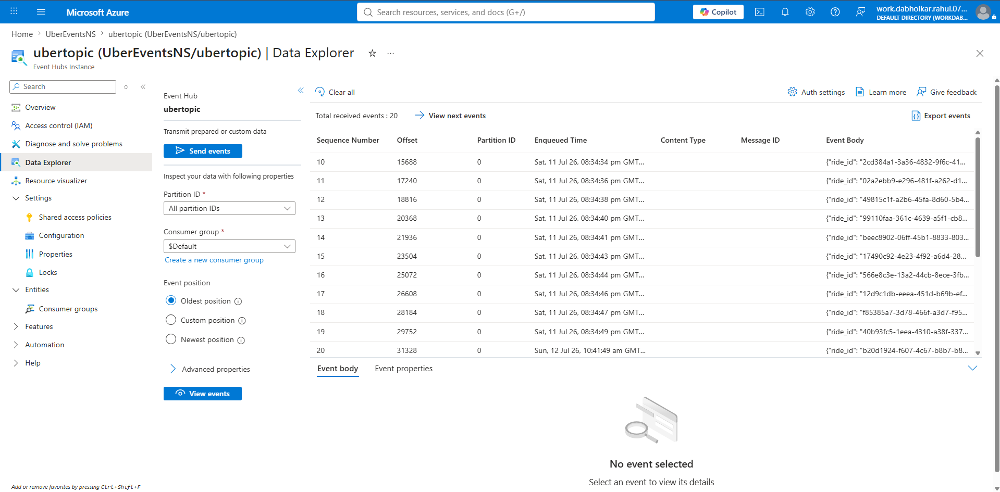

---

## 3. Processing & Medallion Layer (Delta Live Tables)

The pipeline is defined as a unified **Databricks Delta Live Tables (DLT)** pipeline following portable, environment-independent practices:

### A. Bronze Layer
* [ingest.py](file:///g:/LIVE/uber-data-pipeline/databricks/uber-rides-ingestion-pipeline/transformations/ingest.py): Uses the Spark-Kafka streaming connector to read from Event Hub and lands raw bytes cast to String in `rides_raw`.
* [silver.py](file:///g:/LIVE/uber-data-pipeline/databricks/uber-rides-ingestion-pipeline/transformations/silver.py): Defines `stg_rides`, merging historical records from `bulk_rides` with the parsed real-time stream `rides_raw` using `append_flow`.

### B. Silver Layer
* [silver-obt.sql](file:///g:/LIVE/uber-data-pipeline/databricks/uber-rides-ingestion-pipeline/transformations/silver-obt.sql): Implements a stream-static join between `stg_rides` (stream) and the static dimension lookup tables (`map_cities`, `map_vehicle_types`, etc.).
* **Watermarking:** Sets a 3-minute delay watermark on `booking_timestamp` to handle late-arriving stream logs correctly.

### C. Gold Layer (Dimensional Modeling & SCD 2)
* [model.py](file:///g:/LIVE/uber-data-pipeline/databricks/uber-rides-ingestion-pipeline/transformations/model.py): Defines the star schema fact and dimension tables:
  * **SCD Type 1 (Overwrite):** Applied to low-volatility tables (`dim_payment`, `dim_vehicle`, `dim_booking`) and `fact`.
  * **SCD Type 2 (History Tracking):** Tracks temporal changes in `dim_location` (region shifts), `dim_passenger` (email/phone updates), and `dim_driver` (rating changes).
  * **Streaming Aggregator:** Implements `gold_hourly_city_metrics`, utilizing a 1-hour tumbling window and a 10-minute watermark to track real-time fare trends and cancellation rates.

---

## 4. Execution & Validation

### DLT Pipeline Run UI
Here is the compiled DLT DAG in Databricks showing the processing nodes passing checks successfully:

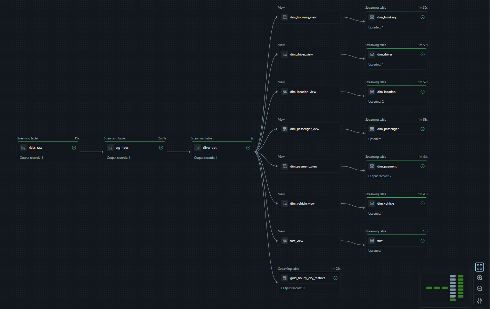

### Verifying SCD Type 2 History
SCD Type 2 history tracking can be verified by running the validation notebook [silver-obt.ipynb](file:///g:/LIVE/uber-data-pipeline/databricks/silver-obt.ipynb). 

#### 1. Location Dimension Updates
When a city name shifts from "New York" to "Super New York", the pipeline creates two rows for `pickup_city_id = 1`—closing out the active flag of the old entry and inserting the new active record:

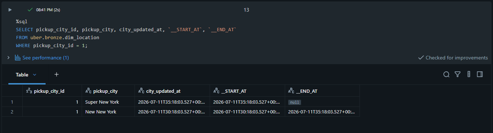

#### 2. Streaming Driver Rating Updates
When the simulator updates driver ratings during the stream, SCD Type 2 captures the old and new ratings:

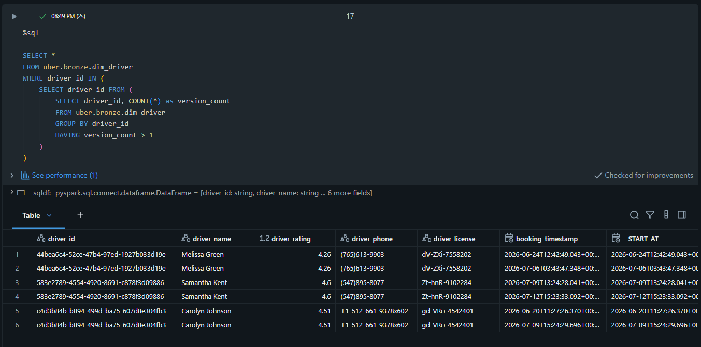

#### 3. Real-Time Streaming Aggregations
Validation of hourly sliding aggregates per city showing completed/cancelled counts and fare averages:

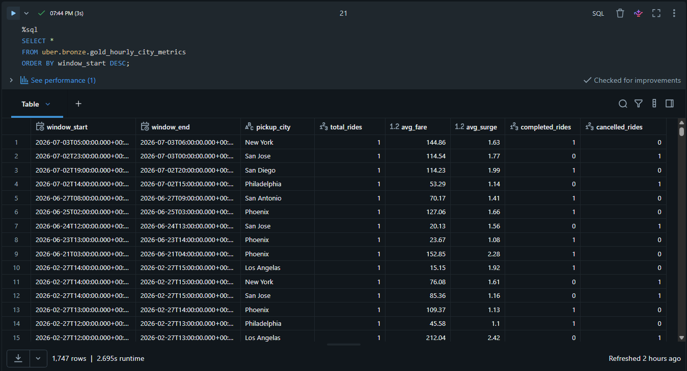

#### 4. Unity Catalog Lineage Graph
The end-to-end data lineage graph automatically captured and displayed in Unity Catalog Explorer:

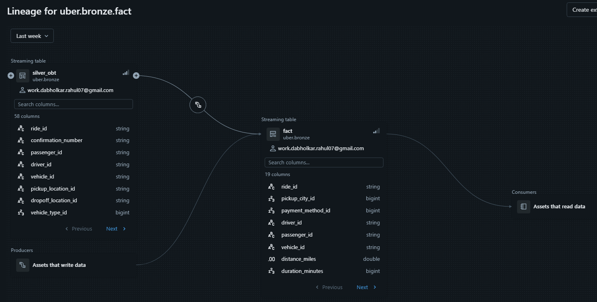

---

## 5. Local Setup Instructions

1. **Install Dependencies:**
   ```bash
   pip install -r requirements.txt
   ```
2. **Environment Configuration:**
   Configure a `.env` file in the `scripts/` folder:
   ```ini
   CONNECTION_STRING=your-event-hub-connection-string
   EVENT_HUBNAME=ubertopic
   ```
3. **Execute Simulator Stream:**
   ```bash
   python scripts/connection.py
   ```
4. **Force Specific Update Event:**
   To force a ride event for a specific city update (e.g. for testing SCD Type 2 on "Super New York"), run:
   ```bash
   python scripts/send_force_ride.py
   ```
